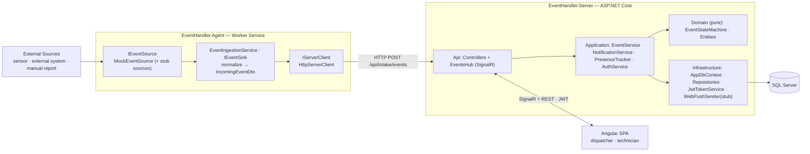
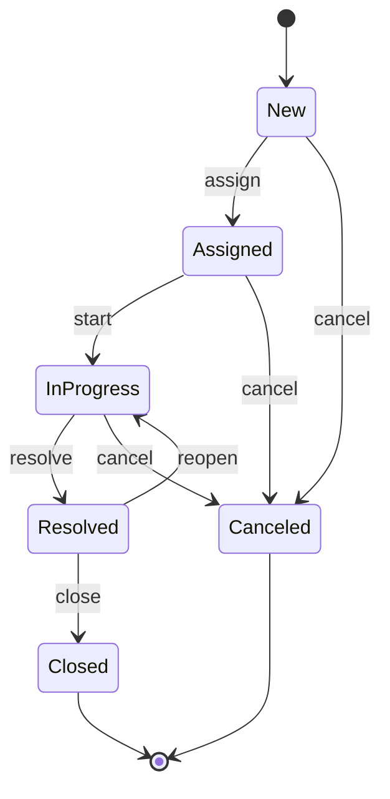
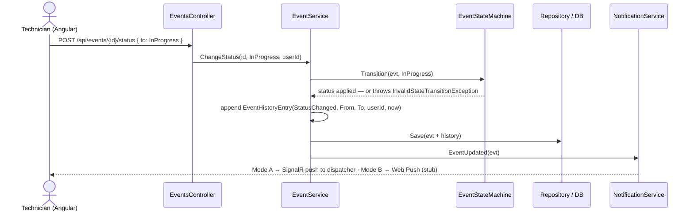
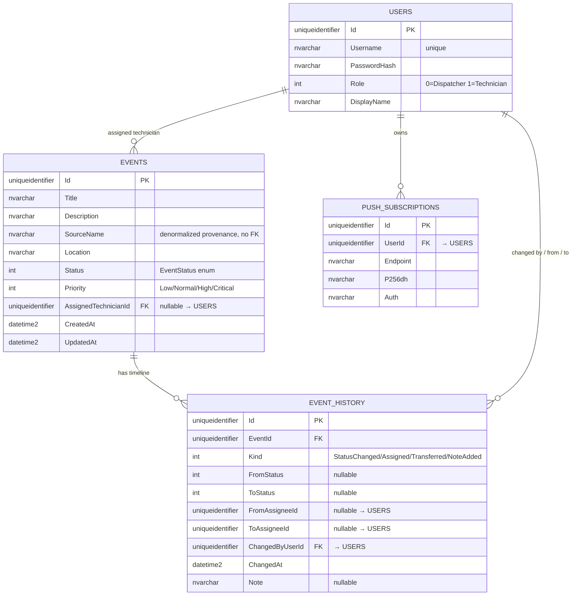

# Plan: Simplified Skeleton Build — Real-Time Field Event Management System

## Context
This supersedes the skeleton in `greedy-gliding-rainbow.md` (and its history amendment
`whimsical-plotting-wozniak.md`) with a **deliberately simpler** version. The prior plan was
over-engineered for a 1-week assignment; you asked to cut complexity now while keeping the code
**extensible** so the cut pieces can return later. Concretely, this session:

1. **Removes the Agent Outbox** (no `IOutboxStore` / `OutboxDispatcher`). The Agent sends events
   **directly over HTTP** to the Server. The send stays behind an `IServerClient` interface so an
   outbox/retry (or a broker) can be dropped in later **without touching sources or ingestion**.
2. **Removes source/external-source authentication** from the skeleton code (no
   `ISourceAuthenticator`, no source key registry, no agent-auth guard on intake).
3. **Adds readable, focused diagrams** (several small mermaid diagrams instead of one dense one).
4. **Makes three flows explicit**: the event **status-change** flow, the **transfer-to-another-
   technician** flow, and exactly **what lives in the State Machine vs. the Event Handler**.
5. **Specifies the SQL tables and their columns** at a high level.

Everything is still a **pure skeleton**: it compiles and runs, method bodies are stubs
(`NotImplementedException` / TODO / placeholder returns). No business logic, no migration, no real
crypto, no working data flow yet — that is a later, separately-scoped step.

> **Deferred, not solved:** the assignment still calls for *source authentication* and *"no event
> lost when the server is down."* We removed their skeleton **code**, and these remain **open design
> concerns** (intended answers: API-key per source; outbox/retry behind `IServerClient` as the
> planned resilience path). Where the required architecture write-up for these now lives is an open
> question — see the note under "Decisions locked" / raised with you separately.

### Decisions locked for this session
- Diagram style: **several small mermaid diagrams**.
- Mode B (browser-closed alerts): **thin stub interface only** — `INotificationService` +
  `IWebPushSender` stubs + Angular `push.service` placeholder.
- First assignment of a `New` event: **one combined history row** (not two). This lets the State
  Machine stop owning history entirely (see boundary below) — simpler and easier to defend.
- Backend split: keep the "middle" layout — `EventHandler.Domain` is its own project (pure,
  testable); `EventHandler.Server` holds Application + Infrastructure + Api as internal folders.
- Stack: **.NET 10 (LTS)**, **EF Core 10** + SQL Server, **xUnit**, **Angular (latest, standalone)**,
  `Microsoft.AspNetCore.SignalR` + `@microsoft/signalr` client, JWT auth, SignalR for Mode A.

---

## 1. System context (simplified)

**Key simplification vs. the old diagram:** the Agent is now just *source → normalize → HTTP send*.
No outbox, no dispatcher, no source-auth box.

---

## 2. State Machine — the event lifecycle

- `EventStatus { New, Assigned, InProgress, Resolved, Closed, Canceled }`.
- `Closed` and `Canceled` are **terminal** (`AllowedNext` returns empty).
- **Transfer is NOT on this diagram** — transferring an event changes the *assignee*, not the
  *status* (see §4). This is the distinction the state diagram makes visible.
- The exact table above is the **proposed** set; it lives **in code** and is what the unit tests
  pin down. Adjust freely before build.

---

## 3. What is in the State Machine vs. the Event Handler
This boundary is the heart of the design, so it is stated explicitly.

| Concern | **State Machine** (`Domain`, pure) | **Event Handler = `EventService`** (`Application`) |
|---|---|---|
| Knows the legal status transitions | ✅ owns the transition table | ❌ asks the SM |
| Applies a status change to `Event.Status` | ✅ `Transition(evt, to)` | ❌ |
| Rejects illegal transitions | ✅ throws `InvalidStateTransitionException` | ❌ |
| Writes history rows (status **and** assignee) | ❌ never | ✅ **single author** |
| Sets the assignee (assign / transfer) | ❌ never | ✅ |
| Talks to DB / repositories | ❌ never | ✅ |
| Sends notifications / alerts | ❌ never | ✅ (via `NotificationService`) |
| Row-level permissions (tech sees only own) | ❌ never | ✅ |
| Knows about users, time, JWT, EF, SignalR | ❌ never (pure, zero infra deps) | ✅ |

```csharp
// Domain/StateMachine — pure, no infra, fully unit-tested
public interface IEventStateMachine {
    bool CanTransition(EventStatus from, EventStatus to);
    IReadOnlyCollection<EventStatus> AllowedNext(EventStatus from);
    void Transition(Event evt, EventStatus to);   // validates via table, sets evt.Status, else throws
}
```
**Why the SM no longer writes history** (enabled by the "one combined row" choice): making
`EventService` the *sole* history author means assign/transfer/status/note all record history the
same way, and the first-assign combined row is natural. The SM shrinks to a pure
`(from,to) → legal? + apply` unit — the cleanest possible thing to unit-test, and trivial to
explain in review.

---

## 4. The two flows you asked to see

### 4a. Status change (e.g. technician moves an event to InProgress)


### 4b. Transfer from Technician A to Technician B (both get notified)
```mermaid
sequenceDiagram
    actor Disp as Dispatcher (Angular)
    participant API as EventsController
    participant SVC as EventService
    participant DB as Repository / DB
    participant N as NotificationService
    Disp->>API: POST /api/events/{id}/transfer { toTechnicianId: B }
    API->>SVC: Transfer(id, B, dispatcherId)
    SVC->>SVC: A = evt.AssignedTechnicianId ; evt.AssignedTechnicianId = B
    Note over SVC: status is unchanged — SM is NOT involved
    SVC->>SVC: append EventHistoryEntry(Transferred, FromAssignee=A, ToAssignee=B, dispatcherId, now)
    SVC->>DB: Save(evt + history)
    SVC->>N: notify A (removed) AND B (assigned)
    N-->>A: SignalR to group user:{A} (Mode A) / Web Push (Mode B)
    N-->>B: SignalR to group user:{B} (Mode A) / Web Push (Mode B)
```
**First assignment** (`New` event, dispatcher assigns A) is the same as transfer except: it also
moves status `New → Assigned` (validated via `SM.CanTransition`, applied via `SM.Transition`), and
records **one** combined `EventHistoryEntry { Kind = Assigned, FromStatus=New, ToStatus=Assigned,
ToAssigneeId=A }`.

---

## 5. SQL tables (high level)

- **`EVENT_HISTORY` is one unified timeline** for both status and assignee changes. Status-only
  rows leave assignee columns null; transfer rows leave status columns null; the first-assign row
  fills both. Index `(EventId, ChangedAt)` for the UI timeline query.
- `SourceName` is copied from the incoming event for display/provenance — **no `Source` table**
  (dropped with source-auth). No FK, no lookup.
- Enums stored **as int**. EF `IEntityTypeConfiguration<>` per entity. **No migration in the
  skeleton** (TODO note); `DbSeeder` inserts a dispatcher + a couple of technicians (stub).

---

## 6. Repository tree (skeleton)
```
EventHandler.sln
backend/
  src/
    EventHandler.Contracts/     # ONLY the Agent↔Server intake contract (IncomingEventDto, IntakeResponseDto)
    EventHandler.Domain/        # Entities, enums, EventStateMachine, port interfaces — pure, no infra
    EventHandler.Server/        # ASP.NET Core host
        Api/            Controllers, Hubs, Auth, Dtos, Program.cs, appsettings
        Application/    EventService, NotificationService, PresenceTracker, AuthService (+ interfaces)
        Infrastructure/ AppDbContext, Repositories, JwtTokenService, WebPushSender(stub), DbSeeder, PasswordHasher
    EventHandler.Agent/         # Worker Service: IEventSource, MockEventSource, EventIngestionService, HttpServerClient
  tests/
    EventHandler.Domain.Tests/  # xUnit — State Machine unit tests (mandatory)
frontend/                       # Angular (core / features / shared / layout)
docs/                           # plans/ (this file) + REQUIREMENTS_CHECKLIST.md (existing)
```

---

## 7. Backend skeleton — by layer

**Contracts** — `IncomingEventDto` (`SourceName, SourceEventId, Title, Description, Location,
OccurredAt, Severity?`), `IntakeResponseDto` (`ServerEventId, Accepted`). Shared by Agent + Server
so the wire contract can't drift.

**Domain** (pure, testable):
- Entities: `Event`, `EventHistoryEntry`, `User`, `PushSubscription` (columns per §5).
- Enums: `EventStatus`, `UserRole { Dispatcher, Technician }`, `Priority { Low, Normal, High,
  Critical }`, `EventChangeKind { StatusChanged, Assigned, Transferred, NoteAdded }`.
- `EventStateMachine` + `InvalidStateTransitionException` (transition table in code; stub bodies,
  table shape in comments). Interface per §3.
- Ports (`Domain/Abstractions/`): `IEventRepository`, `IUserRepository`,
  `IPushSubscriptionRepository`, `IUnitOfWork`.

**Application** (`Server/Application/`) — interfaces + stub classes:
- `IEventService` / `EventService`: `CreateFromIntake`, `Assign`, `Transfer`, `ChangeStatus`,
  `Close`, `AddNote`, `ListForUser` (row-level filter: technician sees only assigned), `GetHistory`,
  `RequestAvailable`. **Sole history author.**
- `IPresenceTracker` / `PresenceTracker`: in-memory `ConcurrentDictionary<userId, connections>`;
  `MarkConnected/MarkDisconnected/IsConnected`. Fed by the hub.
- `INotificationService` / `NotificationService`: if `PresenceTracker` says connected → SignalR
  (Mode A); else → `IWebPushSender` (Mode B stub).
- `IAuthService` / `AuthService`: `Login` (verify hash, issue JWT). `IJwtTokenService`,
  `IWebPushSender` interfaces (impls in Infrastructure).

**Api** (`Server/Api/`):
- DTOs (`Api/Dtos/`): `LoginRequestDto`/`LoginResponseDto`, `EventDto`, `EventHistoryDto`
  (`Kind, FromStatus?, ToStatus?, FromAssigneeId?, ToAssigneeId?, ChangedByDisplayName, ChangedAt,
  Note`), `AssignRequestDto`, `TransferRequestDto`, `StatusChangeRequestDto`, `NoteDto`,
  `PushSubscriptionDto`. Angular mirrors these shapes.
- Controllers (thin, `[Authorize]`, all actions stubbed): `AuthController` (`POST /api/auth/login`);
  `EventsController` (`GET /api/events` role-filtered, `GET /{id}`, `POST /{id}/assign`,
  `/transfer`, `/status`, `/close`, `GET /{id}/history`, `POST /{id}/notes`, `GET /available`);
  `IntakeController` (`POST /api/intake/events` — **open in skeleton**, agent-auth is a documented
  TODO); `PushController` (`POST /api/push/subscribe`, `DELETE`).
- `EventsHub` (SignalR): `OnConnected/OnDisconnected` → `PresenceTracker`; groups `user:{id}` and
  `role:Dispatcher`. Pushes `EventCreated`, `EventUpdated`, `EventAssigned`, `Alert`.
- Auth: JWT bearer config (incl. reading the token from the SignalR `access_token` query string);
  role policies (`[Authorize(Roles="Dispatcher")]`). **No `AgentAuthentication` scheme** (removed).
- Cross-cutting: `ExceptionHandlingMiddleware` (stub), `Program.cs` DI, `appsettings`
  (`ConnectionStrings:Sql`, `Jwt:{Secret,Issuer,Audience,Lifetime}`, `WebPush:{PublicKey,
  PrivateKey,Subject}`), CORS for the Angular origin. (No `Agent:ApiKey`.)

**Infrastructure** (`Server/Infrastructure/`): `AppDbContext` + `IEntityTypeConfiguration<>` per
entity; repository stubs; `JwtTokenService` (stub); `WebPushSender` (Mode-B stub); `DbSeeder`
(stub); `PasswordHasher` wrapper over `Microsoft.AspNetCore.Identity.PasswordHasher<T>`.

---

## 8. Agent skeleton (simplified) — `EventHandler.Agent/`
Separate Worker Service. Extensibility centerpiece, now minimal:
```csharp
public interface IEventSource {
    string Name { get; }
    Task StartAsync(IEventSink sink, CancellationToken ct);
    Task StopAsync(CancellationToken ct);
}
public interface IEventSink   { Task PublishAsync(IncomingEventDto evt, CancellationToken ct); }
public interface IServerClient{ Task<IntakeResponseDto> SendAsync(IncomingEventDto evt, CancellationToken ct); }
```
- `MockEventSource : IEventSource` — emits a synthetic `IncomingEventDto` on an interval/trigger, so
  **running the Agent fires the E2E path**. Front door of the mandatory flow.
- One stub source (`SensorHttpSource`) with comments showing "onboard a new source = implement
  `IEventSource` + register in DI + add config." (No auth box.)
- `EventIngestionService : IEventSink` — normalizes and calls `IServerClient` **directly** (no
  outbox, no buffering).
- `HttpServerClient : IServerClient` — `POST /api/intake/events`. Stub body; no agent-auth header.
- `SourceHostService : BackgroundService` — resolves all `IEventSource` and starts them against the
  ingestion sink. `Program.cs` DI + `appsettings` (`Server:BaseUrl`, per-source config).
- **Extensibility preserved:** the outbox/retry (and the "server-down, no event lost" story) can
  return later purely as a new `IServerClient` implementation — sources and ingestion are unaffected.
  Not coded now.

---

## 9. Frontend skeleton — `frontend/` (Angular, standalone)
```
src/app/
  core/
    auth/          auth.service, auth.guard, role.guard, jwt.interceptor, auth.models
    realtime/      signalr.service            (@microsoft/signalr — connect/reconnect, stub)
    notifications/ push.service               (Web Push registration — SKELETON stub) + service worker
    api/           events.api.ts, http helpers
    models/        event.model, user.model, enums (mirror Api/Dtos shapes)
  features/
    auth/login/                               login component (stub)
    dispatcher/    dashboard, event-list, event-detail, assign, transfer, technician-status
    technician/    my-events, event-detail, status-update, notes, request-available
  shared/          shared components / pipes
  layout/          shell + role-aware nav
  app.routes.ts    role-guarded routes (dispatcher/* , technician/* , login)
  app.config.ts    providers (interceptor, router)
```
- `authGuard` + `roleGuard` = **UX only**; real enforcement is server-side.
- `SignalrService` connects with the JWT, subscribes to `EventUpdated`/`Alert` (methods stubbed).
- `push.service` + service worker registered as a **stub** (subscribe + deep-link handler stubbed).
- All components are stubs (template placeholder + TODO); services expose typed signatures returning
  empty/mock observables.

---

## 10. Tests skeleton — `EventHandler.Domain.Tests/`
xUnit referencing `Domain`. `EventStateMachineTests` with named, skipped/TODO stubs over the graded
surface — now purely about the transition table (SM writes no history):
- Each allowed transition applies the new status; `CanTransition` returns true.
- Each disallowed transition throws `InvalidStateTransitionException` and does **not** mutate status.
- `AllowedNext(from)` returns the exact expected set for every state.
- `Closed` and `Canceled` are terminal (`AllowedNext` empty); `Canceled` reachable only from
  pre-closed states.
- (History-stamping is now an `EventService` concern — optional `EventServiceTests` stubs noted, not
  part of the mandatory SM suite.)

---

## 11. Verification
- `dotnet build` on the solution succeeds (skeleton compiles).
- `dotnet run` the Server: app starts, Swagger lists all endpoints, `/health` responds.
- `dotnet run` the Agent: `MockEventSource` starts and `HttpServerClient` attempts a direct
  `POST /api/intake/events` (logs the stubbed call) — proves the simplified wiring path end to end.
- `dotnet test`: `EventHandler.Domain.Tests` is discovered and runs (SM stubs skipped/pending).
- `ng serve`: Angular boots, login route renders, role-guarded routes exist.
- Traceability: every assignment feature has a representing artifact **or** a documented design
  section (source-auth + resilience are the doc-only ones this pass).

## 12. Out of scope (this session)
No business logic, no EF migration, no real JWT/crypto, no working E2E data flow, no real Web Push
delivery, no Agent outbox, no source-auth code — all deferred or documented-only.
